# Dokumentasi Sistem Informasi Pengelolaan Data Nasabah Bank BTN

## 📋 Informasi Umum

| Item | Keterangan |
|------|-----------|
| **Nama Sistem** | Sistem Informasi Pengelolaan Data Nasabah (SIPDN) |
| **Institusi** | Bank BTN Kantor Cabang Pekanbaru |
| **Versi** | 1.0 |
| **Bahasa Pemrograman** | PHP 8.2 (Native MVC) |
| **Database** | MySQL 8.x |
| **Frontend** | Tailwind CSS + Chart.js + Font Awesome 6.5 |
| **Arsitektur** | Model-View-Controller (MVC) |
| **Keamanan** | Bcrypt, CSRF Token, Prepared Statement, Session Timeout |
| **URL** | `http://localhost/PengolahanDataBanking/public` |

---

## 1. Deskripsi Sistem

Sistem Informasi Pengelolaan Data Nasabah Bank BTN (SIPDN BTN) adalah aplikasi berbasis web yang dirancang untuk mengelola data nasabah, rekening, transaksi, dan kredit pada Bank BTN Kantor Cabang Pekanbaru. Sistem ini menggunakan arsitektur MVC (Model-View-Controller) tanpa framework dengan pendekatan role-based access control (RBAC) untuk mengatur hak akses setiap pengguna berdasarkan jabatan dan tanggung jawabnya.

---

## 2. Arsitektur Sistem

### 2.1 Struktur Direktori

```
PengolahanDataBanking/
├── app/
│   ├── config/
│   │   ├── Config.php          # Konfigurasi aplikasi
│   │   └── Database.php        # Koneksi database (PDO Singleton)
│   ├── controllers/
│   │   ├── AuthController.php      # Login & Logout
│   │   ├── DashboardController.php # Halaman utama/statistik
│   │   ├── NasabahController.php   # CRUD data nasabah
│   │   ├── RekeningController.php  # CRUD data rekening
│   │   ├── TransaksiController.php # CRUD data transaksi
│   │   ├── KreditController.php    # CRUD data kredit
│   │   ├── LaporanController.php   # Generate laporan
│   │   ├── UserController.php      # Manajemen pengguna
│   │   └── ProfileController.php   # Profil pengguna
│   ├── helpers/
│   │   ├── Auth.php            # Autentikasi & otorisasi
│   │   ├── Session.php         # Manajemen session
│   │   ├── Helper.php          # Fungsi utilitas
│   │   ├── Validation.php      # Validasi input
│   │   └── Upload.php          # Upload file
│   ├── models/
│   │   ├── User.php            # Model pengguna
│   │   ├── Nasabah.php         # Model nasabah
│   │   ├── Rekening.php        # Model rekening
│   │   ├── Transaksi.php       # Model transaksi
│   │   ├── Kredit.php          # Model kredit
│   │   └── Angsuran.php        # Model angsuran
│   └── views/
│       ├── layouts/            # Template (header, sidebar, footer)
│       ├── auth/               # Halaman login
│       ├── dashboard/          # Halaman dashboard
│       ├── nasabah/            # Halaman CRUD nasabah
│       ├── rekening/           # Halaman CRUD rekening
│       ├── transaksi/          # Halaman CRUD transaksi
│       ├── kredit/             # Halaman CRUD kredit
│       ├── laporan/            # Halaman laporan & cetak
│       ├── users/              # Halaman manajemen user
│       └── profile/            # Halaman profil
├── core/
│   ├── App.php                 # Router utama
│   ├── Controller.php          # Base controller
│   └── Model.php               # Base model (PDO wrapper)
├── database/
│   └── database.sql            # Schema & seed data
├── public/
│   ├── index.php               # Entry point
│   ├── .htaccess               # URL rewriting
│   └── assets/                 # CSS, JS, gambar, uploads
└── .htaccess                   # Redirect ke public/
```

### 2.2 Pola Arsitektur MVC

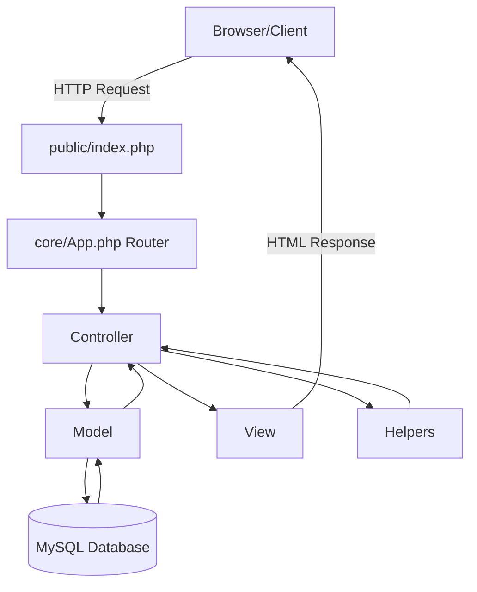

### 2.3 Mekanisme Routing

| URL Segment | Controller | Deskripsi |
|-------------|-----------|-----------|
| `auth` | AuthController | Autentikasi (login/logout) |
| `dashboard` | DashboardController | Halaman utama & statistik |
| `nasabah` | NasabahController | Pengelolaan data nasabah |
| `rekening` | RekeningController | Pengelolaan rekening |
| `transaksi` | TransaksiController | Pengelolaan transaksi |
| `kredit` | KreditController | Pengelolaan kredit |
| `laporan` | LaporanController | Laporan & cetak |
| `users` | UserController | Manajemen pengguna |
| `profile` | ProfileController | Profil pengguna |

Format URL: `BASE_URL/{controller}/{method}/{parameter}`

---

## 3. Desain Database (ERD)

### 3.1 Entity Relationship Diagram

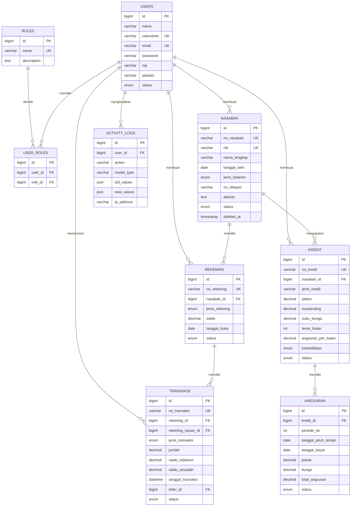

### 3.2 Daftar Tabel

| No | Tabel | Deskripsi | Jumlah Kolom |
|----|-------|-----------|:------------:|
| 1 | `roles` | Daftar role/jabatan pengguna | 4 |
| 2 | `users` | Data pengguna sistem | 13 |
| 3 | `user_roles` | Relasi user-role (pivot) | 4 |
| 4 | `nasabah` | Data nasabah bank | 24 |
| 5 | `rekening` | Data rekening nasabah | 14 |
| 6 | `transaksi` | Data transaksi keuangan | 13 |
| 7 | `kredit` | Data kredit/pinjaman | 17 |
| 8 | `angsuran` | Jadwal & pembayaran angsuran | 11 |
| 9 | `activity_logs` | Log aktivitas (audit trail) | 10 |

### 3.3 Relasi Antar Tabel

| Tabel Asal | Kolom | Tabel Tujuan | Kolom | On Delete |
|------------|-------|-------------|-------|-----------|
| user_roles | user_id | users | id | CASCADE |
| user_roles | role_id | roles | id | CASCADE |
| nasabah | created_by | users | id | SET NULL |
| nasabah | updated_by | users | id | SET NULL |
| rekening | nasabah_id | nasabah | id | CASCADE |
| rekening | created_by | users | id | SET NULL |
| transaksi | rekening_id | rekening | id | CASCADE |
| transaksi | rekening_tujuan_id | rekening | id | SET NULL |
| transaksi | teller_id | users | id | — |
| kredit | nasabah_id | nasabah | id | CASCADE |
| kredit | created_by | users | id | SET NULL |
| angsuran | kredit_id | kredit | id | CASCADE |
| activity_logs | user_id | users | id | SET NULL |

---

## 4. Hak Akses Pengguna (Role-Based Access Control)

### 4.1 Daftar Role

| No | Role | Nama Jabatan | Deskripsi |
|----|------|-------------|-----------|
| 1 | `admin` | Superadmin / Administrator | Mengelola seluruh sistem & manajemen user |
| 2 | `cs` | Customer Service | Input & update data nasabah, rekening, transaksi |
| 3 | `backoffice` | Back Office | Verifikasi data, kelola rekening & kredit |
| 4 | `manager` | Kepala Cabang / Manager | Monitoring, persetujuan & laporan |
| 5 | `auditor` | Auditor Internal | Audit trail & laporan kepatuhan |

### 4.2 Matriks Hak Akses

| Fitur / Menu | Admin | CS | Back Office | Manager | Auditor |
|:-------------|:-----:|:--:|:-----------:|:-------:|:-------:|
| **Dashboard** | ✅ | ✅ | ✅ | ✅ | ✅ |
| **Data Nasabah** | | | | | |
| → Lihat daftar | ✅ | ✅ | ✅ | ✅ | ❌ |
| → Lihat detail | ✅ | ✅ | ✅ | ✅ | ❌ |
| → Tambah nasabah | ✅ | ✅ | ❌ | ❌ | ❌ |
| → Edit nasabah | ✅ | ✅ | ❌ | ❌ | ❌ |
| → Hapus nasabah | ✅ | ❌ | ❌ | ❌ | ❌ |
| **Data Rekening** | | | | | |
| → Lihat daftar | ✅ | ✅ | ✅ | ❌ | ❌ |
| → Lihat detail | ✅ | ✅ | ✅ | ✅ | ❌ |
| → Buka rekening baru | ✅ | ✅ | ✅ | ❌ | ❌ |
| → Update status | ✅ | ❌ | ✅ | ❌ | ❌ |
| **Data Transaksi** | | | | | |
| → Lihat daftar | ✅ | ✅ | ❌ | ✅ | ❌ |
| → Lihat detail | ✅ | ✅ | ✅ | ✅ | ❌ |
| → Input transaksi | ✅ | ✅ | ❌ | ❌ | ❌ |
| **Data Kredit** | | | | | |
| → Lihat daftar | ✅ | ❌ | ✅ | ✅ | ❌ |
| → Lihat detail | ✅ | ✅ | ✅ | ✅ | ❌ |
| → Input kredit baru | ✅ | ❌ | ✅ | ❌ | ❌ |
| → Update status kredit | ✅ | ❌ | ✅ | ❌ | ❌ |
| → Bayar angsuran | ✅ | ❌ | ✅ | ❌ | ❌ |
| **Laporan** | | | | | |
| → Laporan nasabah | ✅ | ❌ | ❌ | ✅ | ✅ |
| → Laporan transaksi | ✅ | ❌ | ❌ | ✅ | ✅ |
| → Laporan kredit | ✅ | ❌ | ❌ | ✅ | ✅ |
| → Cetak laporan | ✅ | ❌ | ❌ | ✅ | ✅ |
| **Manajemen User** | | | | | |
| → Lihat daftar user | ✅ | ❌ | ❌ | ❌ | ❌ |
| → Tambah user | ✅ | ❌ | ❌ | ❌ | ❌ |
| → Edit user | ✅ | ❌ | ❌ | ❌ | ❌ |
| → Hapus user | ✅ | ❌ | ❌ | ❌ | ❌ |
| **Profil** | ✅ | ✅ | ✅ | ✅ | ✅ |

---

## 5. Use Case Diagram

### 5.1 Use Case Diagram Keseluruhan

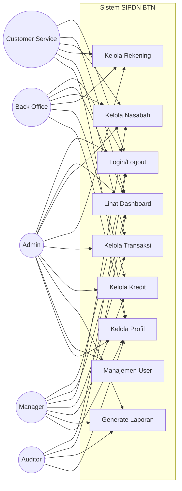

### 5.2 Use Case per Aktor

#### 5.2.1 Admin (Superadmin)

| No | Use Case | Deskripsi |
|----|----------|-----------|
| 1 | Login | Masuk ke sistem dengan username & password |
| 2 | Logout | Keluar dari sistem |
| 3 | Lihat Dashboard | Melihat statistik ringkasan data |
| 4 | Tambah Nasabah | Mendaftarkan nasabah baru |
| 5 | Edit Nasabah | Mengubah data nasabah |
| 6 | Hapus Nasabah | Menghapus data nasabah (soft delete) |
| 7 | Lihat Daftar Nasabah | Melihat seluruh data nasabah |
| 8 | Buka Rekening | Membuka rekening baru untuk nasabah |
| 9 | Update Status Rekening | Mengubah status rekening (aktif/beku/tutup) |
| 10 | Input Transaksi | Melakukan transaksi (setor/tarik/transfer) |
| 11 | Input Kredit | Mendaftarkan kredit baru |
| 12 | Update Status Kredit | Mengubah status/kolektibilitas kredit |
| 13 | Bayar Angsuran | Memproses pembayaran angsuran kredit |
| 14 | Generate Laporan | Membuat laporan nasabah/transaksi/kredit |
| 15 | Cetak Laporan | Mencetak laporan dalam format siap cetak |
| 16 | Tambah User | Mendaftarkan pengguna baru |
| 17 | Edit User | Mengubah data pengguna |
| 18 | Hapus User | Menonaktifkan/menghapus pengguna |
| 19 | Kelola Profil | Mengubah data profil & password sendiri |

#### 5.2.2 Customer Service (CS)

| No | Use Case | Deskripsi |
|----|----------|-----------|
| 1 | Login | Masuk ke sistem |
| 2 | Logout | Keluar dari sistem |
| 3 | Lihat Dashboard | Melihat statistik ringkasan |
| 4 | Tambah Nasabah | Mendaftarkan nasabah baru |
| 5 | Edit Nasabah | Mengubah data nasabah |
| 6 | Lihat Daftar Nasabah | Melihat & mencari data nasabah |
| 7 | Lihat Detail Nasabah | Melihat informasi lengkap nasabah |
| 8 | Buka Rekening | Membuka rekening baru |
| 9 | Lihat Daftar Rekening | Melihat daftar rekening |
| 10 | Input Transaksi | Melakukan transaksi keuangan |
| 11 | Lihat Daftar Transaksi | Melihat riwayat transaksi |
| 12 | Kelola Profil | Mengubah data profil sendiri |

#### 5.2.3 Back Office (BO)

| No | Use Case | Deskripsi |
|----|----------|-----------|
| 1 | Login | Masuk ke sistem |
| 2 | Logout | Keluar dari sistem |
| 3 | Lihat Dashboard | Melihat statistik ringkasan |
| 4 | Lihat Daftar Nasabah | Melihat & memverifikasi data nasabah |
| 5 | Lihat Daftar Rekening | Melihat daftar rekening |
| 6 | Buka Rekening | Membuka rekening baru |
| 7 | Update Status Rekening | Mengaktifkan/membekukan/menutup rekening |
| 8 | Input Kredit | Mendaftarkan pengajuan kredit baru |
| 9 | Update Status Kredit | Mengubah status kredit |
| 10 | Bayar Angsuran | Memproses pembayaran angsuran |
| 11 | Lihat Daftar Kredit | Melihat portofolio kredit |
| 12 | Kelola Profil | Mengubah data profil sendiri |

#### 5.2.4 Manager (Kepala Cabang)

| No | Use Case | Deskripsi |
|----|----------|-----------|
| 1 | Login | Masuk ke sistem |
| 2 | Logout | Keluar dari sistem |
| 3 | Lihat Dashboard | Melihat statistik & monitoring kinerja |
| 4 | Lihat Daftar Nasabah | Monitoring pertumbuhan nasabah |
| 5 | Lihat Daftar Transaksi | Monitoring volume transaksi |
| 6 | Lihat Daftar Kredit | Monitoring portofolio kredit |
| 7 | Generate Laporan Nasabah | Membuat laporan data nasabah |
| 8 | Generate Laporan Transaksi | Membuat laporan transaksi |
| 9 | Generate Laporan Kredit | Membuat laporan kredit |
| 10 | Cetak Laporan | Mencetak laporan untuk pelaporan |
| 11 | Kelola Profil | Mengubah data profil sendiri |

#### 5.2.5 Auditor Internal

| No | Use Case | Deskripsi |
|----|----------|-----------|
| 1 | Login | Masuk ke sistem |
| 2 | Logout | Keluar dari sistem |
| 3 | Lihat Dashboard | Melihat ringkasan umum |
| 4 | Generate Laporan Nasabah | Audit data nasabah |
| 5 | Generate Laporan Transaksi | Audit transaksi keuangan |
| 6 | Generate Laporan Kredit | Audit portofolio kredit & kolektibilitas |
| 7 | Cetak Laporan | Mencetak laporan untuk keperluan audit |
| 8 | Kelola Profil | Mengubah data profil sendiri |

---

## 6. Flow Aplikasi

### 6.1 Flow Umum Sistem

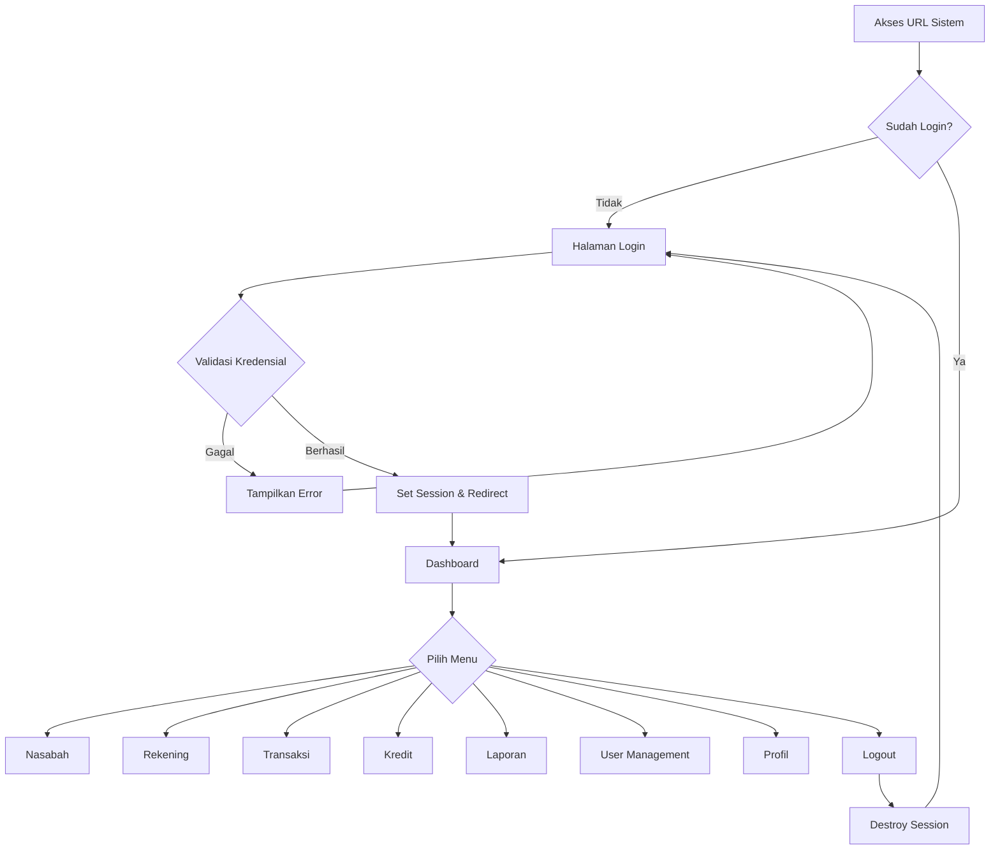

### 6.2 Flow Login

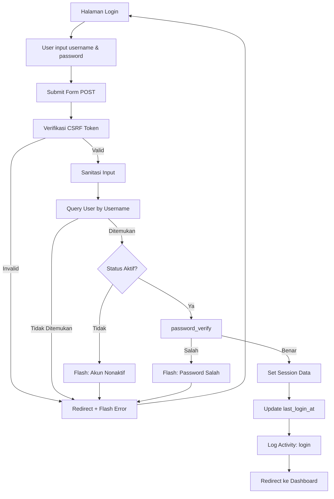

### 6.3 Flow CRUD Nasabah

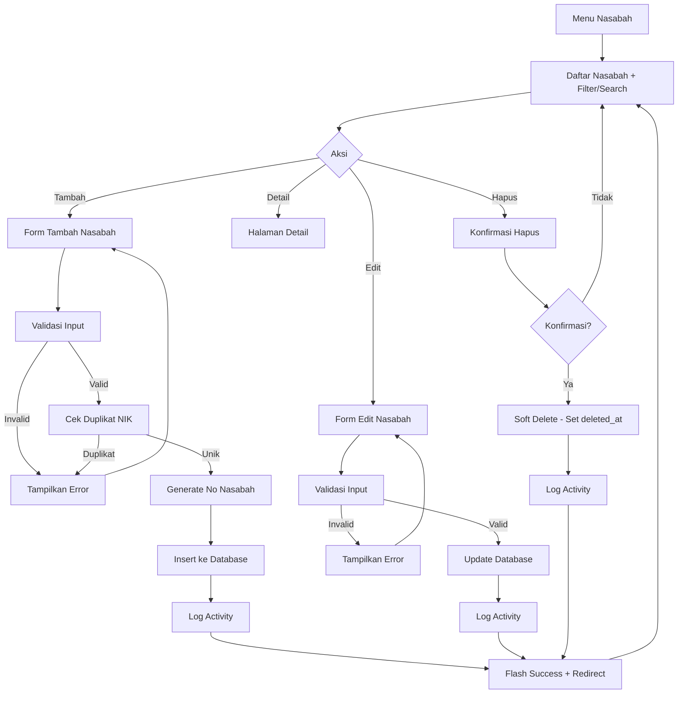

### 6.4 Flow Pembukaan Rekening

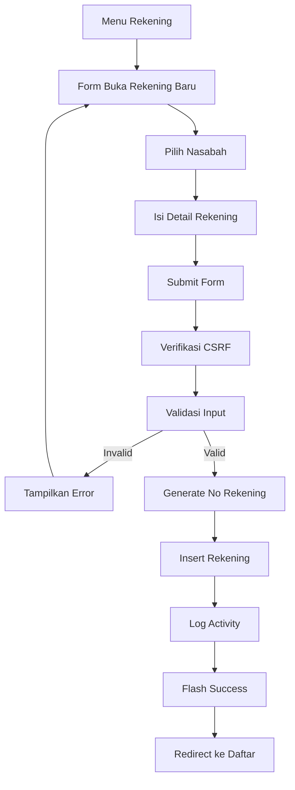

### 6.5 Flow Transaksi Keuangan

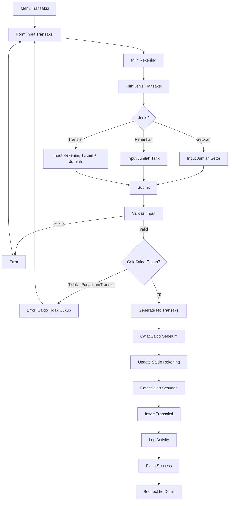

### 6.6 Flow Pengajuan Kredit

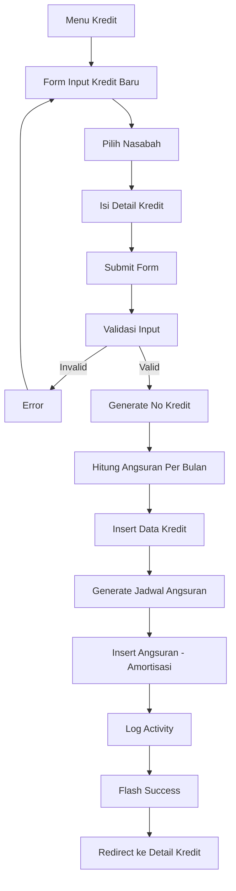

### 6.7 Flow Pembayaran Angsuran

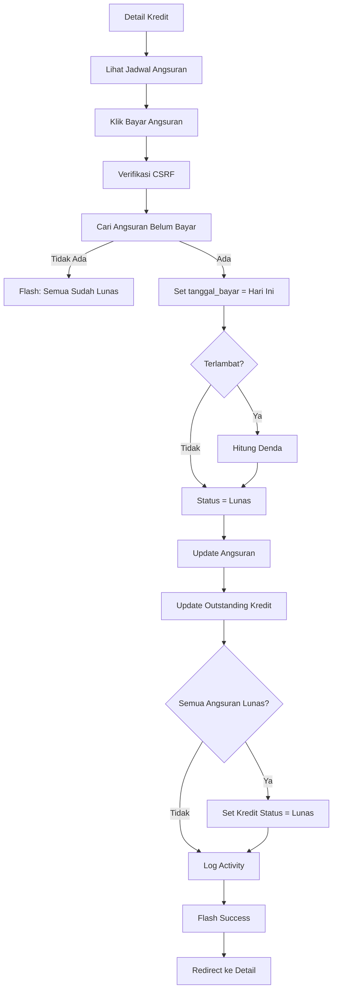

### 6.8 Flow Generate Laporan

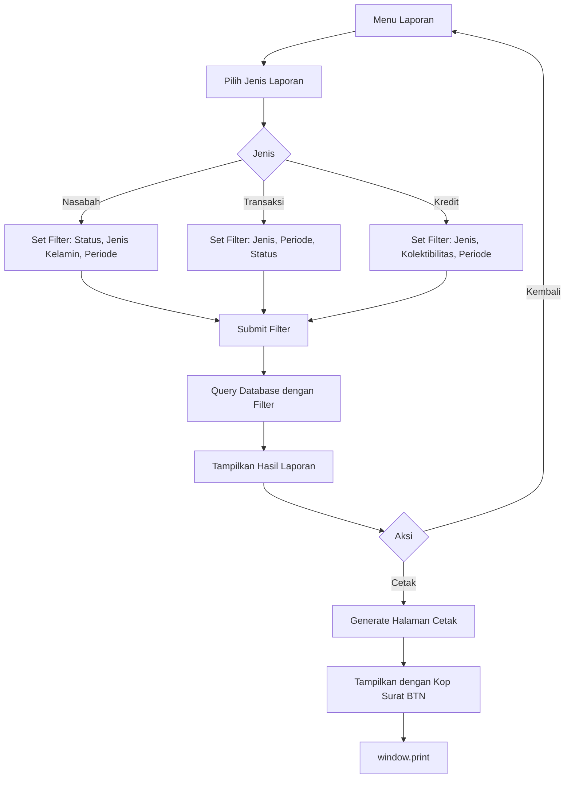

### 6.9 Flow Manajemen User (Admin Only)

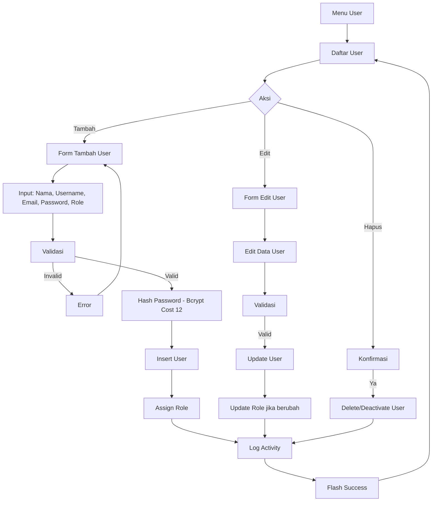

---

## 7. Fitur Keamanan

| No | Fitur | Implementasi |
|----|-------|-------------|
| 1 | **Hashing Password** | Bcrypt dengan cost factor 12 |
| 2 | **CSRF Protection** | Token unik per session pada setiap form |
| 3 | **SQL Injection Prevention** | PDO Prepared Statements |
| 4 | **XSS Prevention** | `htmlspecialchars()` pada output + sanitasi input |
| 5 | **Session Timeout** | Auto-logout setelah 30 menit tidak aktif |
| 6 | **Role-Based Access** | Pengecekan role pada setiap controller/method |
| 7 | **Input Validation** | Validasi server-side (required, min, max, email, numeric, date, unique) |
| 8 | **Soft Delete** | Data nasabah tidak dihapus permanen (menggunakan `deleted_at`) |
| 9 | **Audit Trail** | Setiap aksi penting dicatat di `activity_logs` dengan IP & user agent |
| 10 | **File Upload Validation** | Validasi tipe file, ukuran (max 5MB), dan rename otomatis |

---

## 8. Spesifikasi Teknis

### 8.1 Kebutuhan Sistem (System Requirements)

| Komponen | Minimum |
|----------|---------|
| Web Server | Apache 2.4+ dengan mod_rewrite |
| PHP | 8.0+ (disarankan 8.2) |
| Database | MySQL 8.0+ / MariaDB 10.4+ |
| Browser | Chrome, Firefox, Edge (versi terbaru) |
| RAM Server | 2 GB |
| Storage | 500 MB (aplikasi) + kebutuhan data |

### 8.2 Konfigurasi

| Parameter | Nilai |
|-----------|-------|
| `BASE_URL` | `http://localhost/PengolahanDataBanking/public` |
| `DB_HOST` | `localhost` |
| `DB_NAME` | `pengelolaan_data_banking` |
| `DB_USER` | `root` |
| `DB_PASS` | (kosong / sesuai konfigurasi) |
| `SESSION_TIMEOUT` | 1800 detik (30 menit) |
| `PER_PAGE` | 25 data per halaman |
| `MAX_FILE_SIZE` | 5242880 bytes (5 MB) |

---

## 9. Akun Default untuk Testing

| Username | Password | Role | Akses |
|----------|----------|------|-------|
| `admin` | `admin123` | Admin | Full akses semua fitur |
| `cs_budi` | `admin123` | Customer Service | Nasabah, Rekening, Transaksi |
| `bo_siti` | `admin123` | Back Office | Nasabah, Rekening, Kredit |
| `mgr_ahmad` | `admin123` | Manager | Monitoring & Laporan |
| `aud_dewi` | `admin123` | Auditor | Laporan & Audit |

---

## 10. Panduan Instalasi

1. Clone/Copy project ke folder `htdocs` atau `www`:
   ```
   C:\laragon\www\PengolahanDataBanking\
   ```

2. Import database:
   ```sql
   mysql -u root < database/database.sql
   ```

3. Sesuaikan konfigurasi di `app/config/Config.php`:
   - `BASE_URL` sesuai domain/path
   - `DB_HOST`, `DB_NAME`, `DB_USER`, `DB_PASS`

4. Pastikan Apache mod_rewrite aktif

5. Akses: `http://localhost/PengolahanDataBanking/public/auth/login`

6. Login dengan akun default: `admin` / `admin123`

---

## 11. Tampilan Menu Navigasi per Role

### Admin
```
📊 Dashboard
👥 Data Nasabah
💳 Data Rekening
💰 Data Transaksi
🏦 Data Kredit
📄 Laporan
👤 Manajemen User
⚙️ Profil Saya
```

### Customer Service
```
📊 Dashboard
👥 Data Nasabah
💳 Data Rekening
💰 Data Transaksi
⚙️ Profil Saya
```

### Back Office
```
📊 Dashboard
👥 Data Nasabah
💳 Data Rekening
🏦 Data Kredit
⚙️ Profil Saya
```

### Manager
```
📊 Dashboard
👥 Data Nasabah
💰 Data Transaksi
🏦 Data Kredit
📄 Laporan
⚙️ Profil Saya
```

### Auditor
```
📊 Dashboard
📄 Laporan
⚙️ Profil Saya
```

---

## 12. Skenario Use Case Detail

### UC-01: Login Sistem

| Item | Keterangan |
|------|-----------|
| **Aktor** | Semua pengguna |
| **Deskripsi** | Pengguna masuk ke sistem menggunakan username dan password |
| **Pre-condition** | Pengguna memiliki akun aktif di sistem |
| **Post-condition** | Pengguna berhasil login dan diarahkan ke dashboard |
| **Flow Utama** | 1. Buka halaman login<br>2. Input username dan password<br>3. Klik tombol "Masuk"<br>4. Sistem memvalidasi kredensial<br>5. Redirect ke dashboard |
| **Flow Alternatif** | 3a. Username/password salah → tampilkan pesan error<br>3b. Akun nonaktif → tampilkan pesan akun dinonaktifkan |

### UC-02: Tambah Nasabah

| Item | Keterangan |
|------|-----------|
| **Aktor** | Admin, Customer Service |
| **Deskripsi** | Mendaftarkan nasabah baru ke dalam sistem |
| **Pre-condition** | User sudah login dengan role admin/cs |
| **Post-condition** | Data nasabah tersimpan dengan nomor nasabah otomatis |
| **Flow Utama** | 1. Klik menu "Data Nasabah"<br>2. Klik tombol "Tambah Nasabah"<br>3. Isi formulir (NIK, nama, alamat, dll)<br>4. Klik "Simpan"<br>5. Sistem memvalidasi & menyimpan<br>6. Redirect ke daftar nasabah |
| **Flow Alternatif** | 4a. NIK sudah terdaftar → tampilkan error duplikat<br>4b. Data tidak valid → tampilkan pesan validasi |

### UC-03: Buka Rekening

| Item | Keterangan |
|------|-----------|
| **Aktor** | Admin, CS, Back Office |
| **Deskripsi** | Membuka rekening baru untuk nasabah terdaftar |
| **Pre-condition** | Nasabah sudah terdaftar di sistem |
| **Post-condition** | Rekening baru tercatat dengan nomor rekening otomatis |
| **Flow Utama** | 1. Klik menu "Data Rekening"<br>2. Klik "Buka Rekening Baru"<br>3. Pilih nasabah<br>4. Pilih jenis rekening (Tabungan/Giro/Deposito/Batara)<br>5. Isi detail lainnya<br>6. Klik "Simpan"<br>7. Sistem generate nomor rekening & simpan |

### UC-04: Input Transaksi

| Item | Keterangan |
|------|-----------|
| **Aktor** | Admin, Customer Service |
| **Deskripsi** | Memproses transaksi keuangan (setoran/penarikan/transfer) |
| **Pre-condition** | Rekening nasabah aktif |
| **Post-condition** | Saldo rekening terupdate, transaksi tercatat |
| **Flow Utama** | 1. Klik menu "Data Transaksi"<br>2. Klik "Input Transaksi"<br>3. Pilih rekening<br>4. Pilih jenis transaksi<br>5. Input jumlah & keterangan<br>6. Klik "Proses"<br>7. Saldo diupdate & transaksi tersimpan |
| **Flow Alternatif** | 6a. Saldo tidak cukup (penarikan/transfer) → tampilkan error |

### UC-05: Input Kredit

| Item | Keterangan |
|------|-----------|
| **Aktor** | Admin, Back Office |
| **Deskripsi** | Mendaftarkan pengajuan kredit baru |
| **Pre-condition** | Nasabah terdaftar di sistem |
| **Post-condition** | Kredit tercatat & jadwal angsuran otomatis dibuat |
| **Flow Utama** | 1. Klik menu "Data Kredit"<br>2. Klik "Input Kredit Baru"<br>3. Pilih nasabah<br>4. Isi detail (jenis, plafon, bunga, tenor, jaminan)<br>5. Klik "Simpan"<br>6. Sistem hitung angsuran (amortisasi)<br>7. Generate jadwal angsuran bulanan |

### UC-06: Bayar Angsuran

| Item | Keterangan |
|------|-----------|
| **Aktor** | Admin, Back Office |
| **Deskripsi** | Memproses pembayaran angsuran kredit |
| **Pre-condition** | Kredit aktif dengan angsuran belum lunas |
| **Post-condition** | Angsuran dibayar, outstanding berkurang |
| **Flow Utama** | 1. Buka detail kredit<br>2. Lihat jadwal angsuran<br>3. Klik "Bayar" pada periode berjalan<br>4. Sistem catat pembayaran<br>5. Update outstanding<br>6. Jika semua lunas → status kredit = lunas |

### UC-07: Generate & Cetak Laporan

| Item | Keterangan |
|------|-----------|
| **Aktor** | Admin, Manager, Auditor |
| **Deskripsi** | Membuat laporan dengan filter dan mencetaknya |
| **Pre-condition** | User login dengan role yang sesuai |
| **Post-condition** | Laporan ditampilkan sesuai filter |
| **Flow Utama** | 1. Klik menu "Laporan"<br>2. Pilih jenis laporan (Nasabah/Transaksi/Kredit)<br>3. Set filter (periode, status, jenis)<br>4. Klik "Generate"<br>5. Sistem tampilkan data<br>6. Klik "Cetak" untuk versi cetak dengan kop surat |

### UC-08: Manajemen User

| Item | Keterangan |
|------|-----------|
| **Aktor** | Admin |
| **Deskripsi** | Mengelola akun pengguna sistem |
| **Pre-condition** | User login sebagai admin |
| **Post-condition** | User baru terdaftar / data user terupdate |
| **Flow Utama** | 1. Klik menu "Manajemen User"<br>2. Lihat daftar user<br>3. Klik "Tambah User"<br>4. Isi data (nama, username, email, password, role)<br>5. Klik "Simpan"<br>6. Password di-hash (Bcrypt) & user tersimpan |

---

*Dokumen ini dibuat untuk keperluan laporan hasil penelitian Sistem Informasi Pengelolaan Data Nasabah Bank BTN Kantor Cabang Pekanbaru.*
